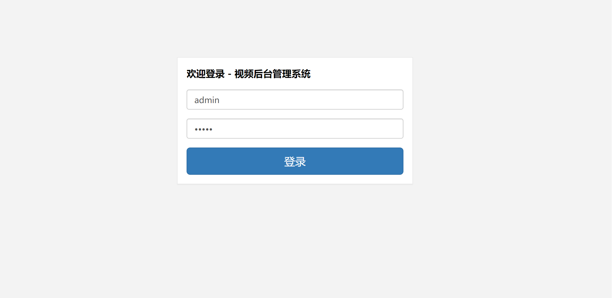
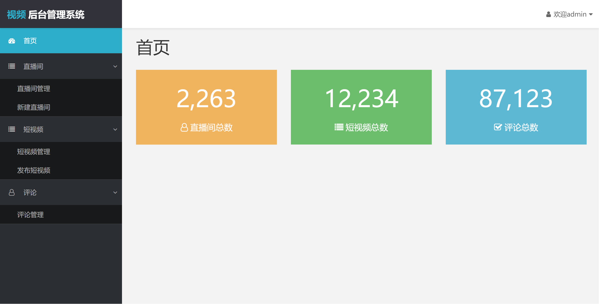
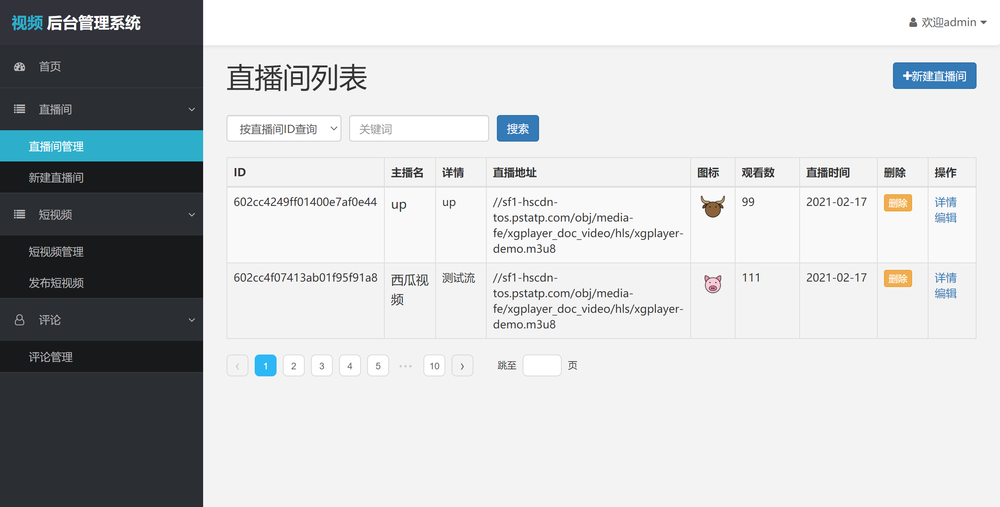
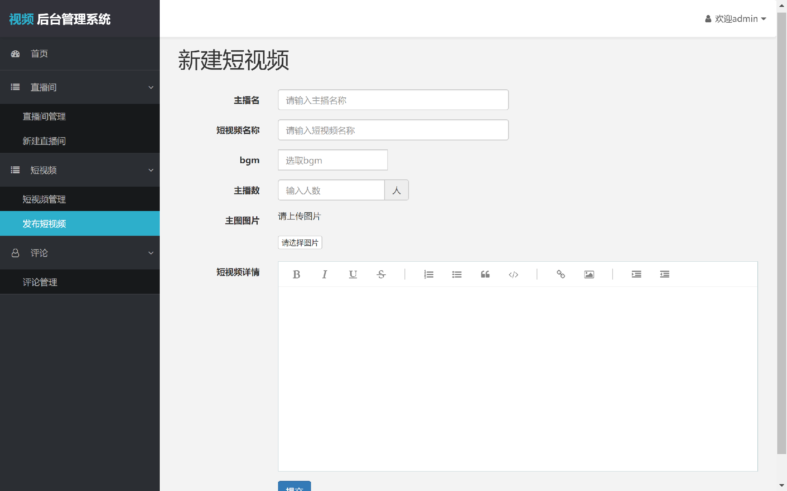
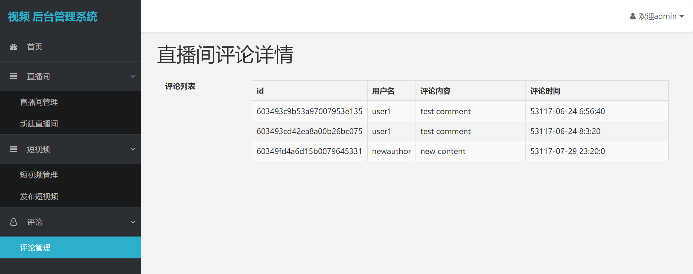

> 视频后台管理系统
>
> * 此项目为字节技术训练营-[我和我的抖音]-前端专场大作业
> * created by 孙晓淳
> * 2021-2

# 视频后台管理系统

# 1. 项目分析

## 1.1 视频后台管理核心需求

* 直播间管理：新建/编辑直播间、查看直播间、删除直播间
* 短视频管理：发布/编辑短视频、查看短视频、删除短视频
* 评论管理：直播间评论列表、评论详情，删除评论
* 用户管理：管理员登录

## 1.2 项目分析与技术选型

### **1.2.1 后台管理系统的特点**

* 改变习惯成本低，兼容性要求不高
* UI要求较低，开发效率要求较高
* 对SEO无高要求

### 1.2.2  技术选型

* 语言和框架：React16+React-router4 + Sass+Bootstrap + ES6
* 架构：前后端分离 + 分层架构 + 模块化开发
* 辅助工具：Yarn + Webpack + Git
* 发布过程：环境部署 -> 代码部署 -> nginx配置 -> 域名解析

【备注】：后端采用训练营提供的轻服务

# 2. 功能介绍

主要包含直播间管理，短视频管理，评论管理三部分。

| 模块         | 功能                     | 完成情况       | 可扩展的点         |
| ------------ | ------------------------ | -------------- | ------------------ |
| 1.用户管理   | 1.1 用户登录             | 完成页面构建   | 完成API            |
|              | 1.2 用户登出             | 完成页面构建   | 完成API            |
| 2.首页       | 2.1 数据统计             | 完成页面构建   | 完成API            |
| 3.直播间管理 | 3.1 查看直播间列表       | 前后端联调完毕 | 增加查询和分页功能 |
|              | 3.2 新建直播间           | 完成页面构建   | 完成API            |
| 4.短视频管理 | 4.1 查看短视频列表       | 前后端联调完毕 | 增加查询和分页功能 |
|              | 4.2 发布短视频           | 完成页面构建   | 完成API            |
| 5. 评论管理  | 5.1 查看某一直播间的评论 | 完成页面构建   | 完成API            |

# 3. 页面展示











# 4. 系统安装和启动方式

**环境依赖:**

```
安装 nodejs v6.12.3版本
安装 yarn
```

**项目初始化方式:**

```
安装依赖包： yarn
```

**开发模式运行:**

```
yarn run dev
```

**线上打包:**

Mac / Linux系统：

```
yarn run dist
```

Windows系统：

```
yarn run dist_win
```

