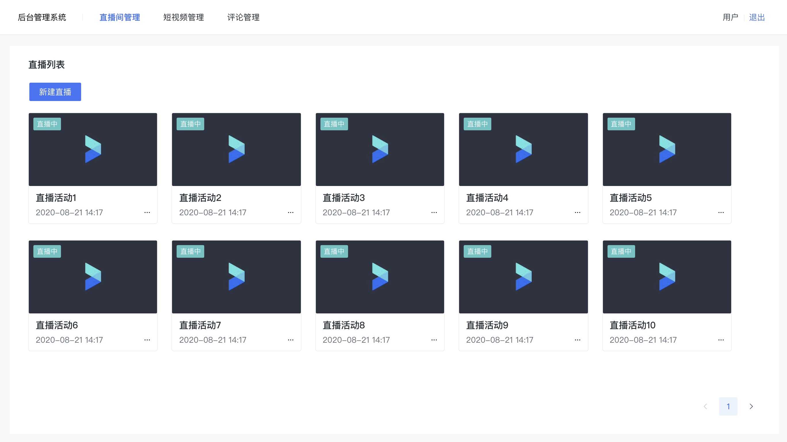

# 【我和我的抖音】前端专场-大作业-第 1 组

## 团队介绍

待定

## 项目分工

| 项目成员 | 担任职责 |   担任职责   |
| :------: | :------: | :----------: |
|   ---    |   组长   |              |
|   ---    |   组员   |              |
|   ---    |   组员   |              |
|   ---    |   组员   | 后台管理系统 |
|   ---    |   组员   |              |

## 项目背景与分析思路

### 背景

抖音是一款现在较流行的短视频软件，比较受年轻人的欢迎。基本形式是通过上下滑动的方式浏览短视频，提供点播、直播的功能使用。

### 分析思路

待定

## 项目内容

### 基础功能

#### 视频点播浏览

实现基础的短视频播放、封面图、上下滑动、手势交互

#### 直播功能

实现直播功能，实时拉取直播流并进行播放

#### 直播聊天

完成直播窗口的实时评论功能
在直播页面下方，可以实时地进行评论的预览和发送

#### 管理后台

实现能管理短视频、直播活动和评论的管理后台

### 扩展功能

#### 视频回查功能（待定）

#### 视频倍速播放功能（待定）

#### ...

## 结论与反思
